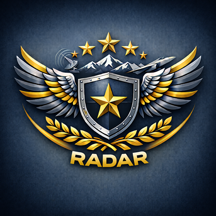
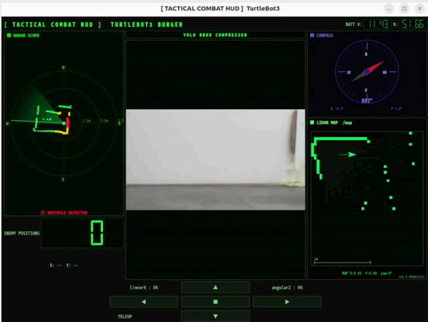
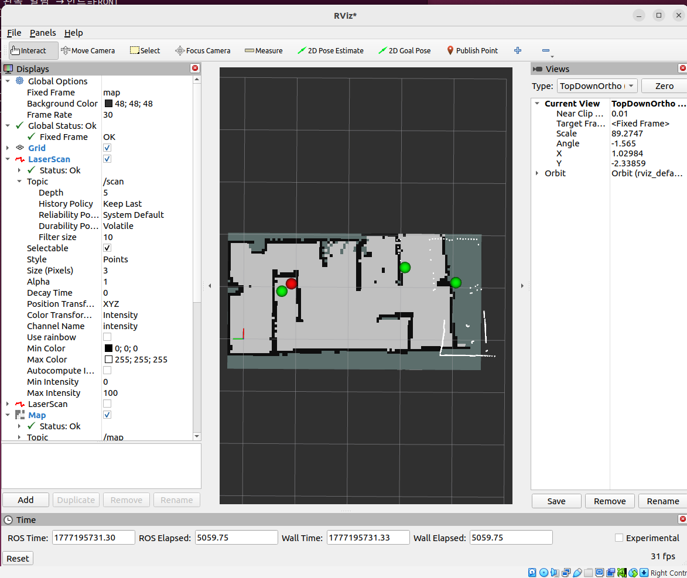

# 🛡️ RADAR
### Risk Aware Detection And Recognition
**전쟁상황 기반 자율 정찰 로봇**

> TurtleBot3 Burger 기반의 자율주행 정찰 로봇으로, 실시간 SLAM과 YOLO 객체 탐지를 통합하여  
> 미지의 전장 환경에서 군인·전차를 탐지하고 위협 위치를 자동으로 지도에 마킹합니다.

<br>

<p align="center">
  
</p>

<p align="center">
  
  
  
  
  
</p>

---

## 📋 목차

- [프로젝트 배경](#-프로젝트-배경)
- [시연 영상](#-시연-영상)
- [팀 구성](#-팀-구성)
- [시스템 구조](#-시스템-구조)
- [주요 기능](#-주요-기능)
- [AI · Perception](#-ai--perception)
- [Path Algorithm](#-path-algorithm)
- [Qt 전술 HUD](#-qt-전술-hud)
- [성능 지표](#-성능-지표)
- [기술 스택](#-기술-스택)
- [설치 및 실행](#-설치-및-실행)
- [트러블 슈팅](#-트러블-슈팅)
- [향후 계획](#-향후-계획)

---

## 🎯 프로젝트 배경

현대 전쟁에서 병력 감소와 인명 피해 문제가 심각해지고 있습니다.  
우크라이나-러시아 전쟁에서 수만 명의 인명 피해가 발생하였으며,  
한국의 가용 병력도 2021년 29만 명에서 2040년 13만 명으로 급감할 전망입니다.

이에 **사람 대신 로봇이 위험한 정찰 임무를 수행**할 수 있는 시스템의 필요성이 대두되었습니다.  
RADAR는 자율주행과 실시간 AI 탐지를 결합해 전장 상황을 안전하게 모니터링하는 것을 목표로 합니다.

---

## 🎬 시연 영상

> ⚠️ 영상 준비 중입니다. 추후 업로드 예정입니다.

```
[ 시연 영상 링크 추가 예정 ]
```

| Qt HUD 실행 화면 | 실제 주행 환경 |
|:---:|:---:|
|  |  |

| SLAM 맵 생성 결과 | YOLO 탐지 결과 |
|:---:|:---:|
|  |  |

---

## 👥 팀 구성

**소속:** Intel 자율주행 9기  
**프로젝트 기간:** 2026.04.13 ~ 2026.04.27

| 역할 | 이름 | 담당 |
|:---:|:---:|:---|
| **TL** | 윤성진 | SLAM · 실시간 맵핑 및 자율주행 |
| **DTL / PM** | 배현규 | AI Perception · YOLO 학습 · Depth Estimation ML |
| **LE** | 안형준 | Overall Development · 시스템 통합 · Reactive 알고리즘 |
| **AE** | 박상호 | Simul UI/UX · Qt HUD · Gazebo 시뮬레이션 |

---

## 🏗️ 시스템 구조

```
┌─────────────────────────── 라즈베리파이 (Pi) ──────────────────────────┐
│                                                                         │
│   [Camera]  ──────►  [YOLO 추론 노드]  ──────►  /detections            │
│                                         └──────►  /yolo_camera/compressed│
│   [LiDAR]   ──────────────────────────────────►  /scan                 │
│                                                                         │
└─────────────────────────────────────────────────────────────────────────┘
                              │ ROS2 DDS (DOMAIN_ID=11)
┌─────────────────────────── Ubuntu (PC) ────────────────────────────────┐
│                                                                         │
│   /detections ──►  [detection_marker_node]  ──►  /danger_detected      │
│   /scan       ──►          │                ──►  /detection_markers     │
│                            │ /robot_turning (feedback)                  │
│   /scan ──────►  [SLAM toolbox]  ──►  /map  ──►  [RViz2]              │
│                                                                         │
│   /danger_detected ──►  [reactive_patrol_node]  ──►  /cmd_vel          │
│                                   │                                     │
│   /map, /scan, /detections ───►  [Qt 전술 HUD]                         │
│                              (레이더·카메라·맵·나침반·적 위치)           │
│                                                                         │
│   /cmd_vel ──►  [TurtleBot3 모터]                                       │
└─────────────────────────────────────────────────────────────────────────┘
```

### 실행 순서

```bash
# 1. Pi: 로봇 구동
bash ~/run_bringup.sh

# 2. Pi: YOLO 추론 시작
bash ~/run_yolo.sh

# 3. Ubuntu: SLAM 시작
bash ~/bin/run_slam.sh

# 4. Ubuntu: map 프레임 생성 확인 후 마커 노드 시작
bash ~/run_marker.sh

# 5. Ubuntu: 자율주행 노드 시작
bash ~/run_reactive.sh

# 6. Ubuntu: RViz 시각화
bash ~/run_rviz.sh
```

---

## ✨ 주요 기능

### 1. 실시간 SLAM 맵핑
- LDS-02 LiDAR 기반 사전 지도 없이 실시간 점유 격자 지도 생성
- SLAM Toolbox (ROS2 Humble) 적용
- RViz2를 통한 실시간 맵 시각화

### 2. YOLO 기반 위협 객체 탐지
- 군인(class 0) / 전차(class 1) 실시간 탐지
- Knowledge Distillation으로 경량화된 YOLO11n 모델 사용
- NCNN 변환을 통해 라즈베리파이에서 5FPS 실시간 추론

### 3. SLAM-YOLO 융합 위협 지도 자동 생성
- TF2 좌표 변환으로 탐지 객체를 맵 좌표계에 등록
- LiDAR + XGBoost 이중 거리 추정으로 마커 정확도 향상
- 3회 확정 카운트 기반 오탐지 필터링
- 군인 → 초록 마커 / 전차 → 빨간 마커

### 4. 위협 연동 자율 회피 순찰
- 확정 위협 좌표 접근 시 자동 유턴 (40cm 이내)
- Visited Grid Map으로 미탐색 구역 우선 순찰
- 위험 구역 블랙리스트(penalty=50) 자동 등록

### 5. Qt 전술 HUD 통합 모니터링
- 레이더 스코프 / YOLO 카메라 / SLAM 맵 / 나침반 / 적 위치 통합 표시
- 텔레오프(수동 조작) 모드 전환 지원
- 배터리 잔량 실시간 모니터링

---

## 🤖 AI · Perception

### YOLO 학습 과정

| 단계 | 데이터셋 | Soldier mAP50 | Tank mAP50 | mAP60 |
|:---:|:---:|:---:|:---:|:---:|
| 1차 (Roboflow, 900장) | 외부 데이터 | 0.097 | 0.073 | 0.040 |
| 2차 (직접 수집, 525장) | 직접 촬영 | 0.835 | 0.895 | 0.865 |
| **KD 적용 (YOLO11n KD)** | **직접 촬영** | **0.862** | **0.917** | **0.889** |
| YOLO11m (참고용) | 직접 촬영 | 0.879 | 0.927 | 0.904 |

### Knowledge Distillation

YOLO11n(2.6M) 크기를 유지하면서 YOLO11m(20.1M) 수준의 성능을 달성하기 위해  
Knowledge Distillation을 적용했습니다.

```
KD Loss = α × YOLO Loss + (1-α) × Teacher Loss

- YOLO Loss   = Box Loss + Class Loss + DFL Loss
- Teacher Loss = Teacher Box Loss + Teacher Class Loss + Teacher DFL Loss
```

> **결과:** YOLO11n 대비 **2.4% mAP 향상**을 2.6M 파라미터 유지하면서 달성

### Depth Estimation (XGBoost)

Depth Camera의 부하·노이즈 문제를 해결하기 위해 ML 기반 거리 추정 모델을 구축했습니다.

- **데이터 수집:** Depth Camera + TurtleBot + Bounding Box 조합 650개
- **Feature (42개):** Bounding Box 좌표, 객체 크기, IMU, ratio 등
- **모델 비교:** Random Forest / Linear Regression / **XGBoost** / LightGBM
- **최종 모델:** XGBoost (Feature Importance 기반 불필요 feature 제거)
- **Test MAE: 3.8cm**

---

## 🗺️ Path Algorithm

### 장애물 회피
1. 전방 장애물 감지 → `escaping = True`
2. 좌우 거리 비교 → 여유 공간 방향으로 회전
3. 정면이 클리어되고 timeout 경과 → 탈출 완료

### 적군 탐지 & 유턴
1. YOLO 탐지 → `/detections` 발행
2. `detection_marker_node`에서 3회 확정 → `/danger_detected` 발행
3. `reactive_patrol_node`에서 위험 좌표 저장
4. 위험 좌표 40cm 이내 접근 시 유턴 시작
5. `STOP(3s) → ROTATE(5s) → ESCAPE(2s) → FORWARD(1s)` 순서로 회피

### 정상 주행 with 커버리지 최적화
1. 벽 보정 주행 (좌우 critical distance 기반)
2. Visited Grid Map으로 지나온 셀 카운트 기록
3. 갈림길에서 방문 횟수가 적은 방향 우선 선택
4. 위험 구역 주변 셀에 패널티(50) 부여 → 재접근 억제

---

## 🖥️ Qt 전술 HUD

```
┌─────────────────────────────────────────────────────────────────┐
│  [ TACTICAL COMBAT HUD ]    TURTLEBOT3 BURGER        BATT: 11.4V│
├──────────────┬──────────────────────────┬───────────────────────┤
│  RADAR SCOPE │   YOLO BBOX COMPRESSED   │  COMPASS              │
│              │                          │     (방향각 실시간)    │
│  (LiDAR 기반 │   (카메라 실시간 영상     │                       │
│   실시간     │    + YOLO bbox 오버레이)  ├───────────────────────┤
│   스캔 시각화)│                          │  LIDAR MAP /map       │
│              │                          │  (SLAM 점유 격자 지도) │
├──────────────┤                          │                       │
│ENEMY POSITIONS│                         │                       │
│  (적 탐지 수 │                          │                       │
│   + 좌표)    │                          │                       │
├──────────────┴──────────────────────────┴───────────────────────┤
│  linearX: 0%    [▲] [■] [▶]    angularZ: 0%                     │
│                 [◀]    [▶]                                       │
│                      TELEOP                                      │
└─────────────────────────────────────────────────────────────────┘
```

**HUD 기능 목록**

| 기능 | 설명 |
|:---|:---|
| Login | 사용자 인증 및 접근 제어 |
| Radar Scope | LiDAR 기반 실시간 스캔 시각화 |
| Compass | IMU 기반 방향각 실시간 표시 |
| Camera | YOLO bbox 오버레이 실시간 영상 |
| LIDAR Map | SLAM 점유 격자 지도 표시 및 마커 |
| Enemy Info | 탐지 적 수 / 좌표 표시 |
| Battery State | 배터리 잔량 모니터링 |
| Manual Mode | 텔레오프 수동 조작 전환 |

---

## 📊 성능 지표

### Map 탐색 성능

| 지표 | Best Case | Average | 목표값 |
|:---:|:---:|:---:|:---:|
| 맵 탐색율 | **96.2%** | 73.4% | 75% |
| 마커 위치 오차 평균 | **10.5cm** | 22.3cm | 20~30cm |
| 객체 미탐지 수 | **1개** | 1.7개 | 1개 이하 |

### YOLO 성능 요약

| 모델 | 파라미터 | Soldier mAP50 | Tank mAP50 | mAP50 |
|:---:|:---:|:---:|:---:|:---:|
| YOLO11n | 2.6M | 0.835 | 0.895 | 0.865 |
| YOLO11n KD | 2.6M | 0.862 | 0.917 | **0.889** |
| YOLO11m | 20.1M | 0.879 | 0.927 | 0.904 |

### Depth Estimation
- **모델:** XGBoost
- **Test MAE:** 3.8cm

---

## 🔧 기술 스택

### System & Dev


### Hardware
| 부품 | 상세 |
|:---|:---|
| 로봇 플랫폼 | TurtleBot3 Burger |
| 온보드 컴퓨터 | Raspberry Pi 4 |
| 모터 컨트롤러 | OpenCR |
| LiDAR | LDS-02 (10Hz, ~220 points) |
| 카메라 | IMX219 PiCamera (640×480) |
| 구동 모터 | Dynamixel XL430 |

### Robotics & Navigation

- SLAM Toolbox, TF2, RViz2, Nav2, Gazebo

### AI & Perception

- Ultralytics YOLO11, NCNN (경량화), Roboflow (데이터셋)
- XGBoost (Depth Estimation), OpenCV
- Knowledge Distillation

### UI
- Qt5 (전술 HUD)

---

## 🚀 설치 및 실행

### 환경 요구사항

```
- Ubuntu 22.04
- ROS2 Humble
- Python 3.10
- Raspberry Pi OS (Pi 4)
- ROS_DOMAIN_ID=11
- TURTLEBOT3_MODEL=burger
```

### 의존성 설치

```bash
# ROS2 Humble 설치 (Ubuntu PC)
sudo apt install ros-humble-slam-toolbox
sudo apt install ros-humble-tf2-geometry-msgs
sudo apt install ros-humble-visualization-msgs

# Python 패키지
pip install ultralytics joblib pandas xgboost scikit-learn --break-system-packages

# NCNN (Pi에서 설치)
pip install ncnn --break-system-packages
```

### 저장소 클론

```bash
git clone https://github.com/[YOUR_REPO]/radar.git
cd radar
```

### 실행 스크립트 권한 설정

```bash
chmod +x ~/run_bringup.sh
chmod +x ~/run_yolo.sh
chmod +x ~/bin/run_slam.sh
chmod +x ~/run_marker.sh
chmod +x ~/run_reactive.sh
chmod +x ~/run_rviz.sh
```

### 실행 (순서 중요)

```bash
# [Pi 터미널 1] TurtleBot3 구동
bash ~/run_bringup.sh

# [Pi 터미널 2] YOLO 추론 노드
bash ~/run_yolo.sh

# [Ubuntu 터미널 1] SLAM
bash ~/bin/run_slam.sh

# [Ubuntu 터미널 2] map 프레임 생성 확인 후
bash ~/run_marker.sh

# [Ubuntu 터미널 3] 자율주행
bash ~/run_reactive.sh

# [Ubuntu 터미널 4] RViz 시각화
bash ~/run_rviz.sh
```

### 포트 설정 (Pi - 재시작 시마다 확인)

```bash
sudo chmod 666 /dev/ttyACM*
```

### 맵 저장

```bash
mkdir -p ~/maps
ros2 run nav2_map_server map_saver_cli -f ~/maps/patrol_map
```

---

## 📁 프로젝트 구조

```
radar/
├── autonomous_driving/
│   ├── reactive_patrol_node.py       # 자율주행 메인 노드
│   ├── detection_marker_node.py      # YOLO-SLAM 융합 마커 노드
│   └── ml/
│       ├── xgb_y_model.pkl           # XGBoost Depth 추정 모델
│       └── xgb_feature_y_cols.pkl    # Feature 컬럼 정보
│
├── project/
│   └── yolo_picamera_to_ubuntu_compressed_default.py  # Pi YOLO 추론 노드
│
├── yolo/
│   ├── weights/depth/                # YOLO .pt 가중치
│   └── ncnn/                         # NCNN 변환 모델
│
├── qt_hud/                           # Qt 전술 HUD 소스
│
├── run_bringup.sh
├── run_yolo.sh
├── run_marker.sh
├── run_reactive.sh
├── run_rviz.sh
└── bin/
    └── run_slam.sh
```

---

## 🔥 트러블 슈팅

### 1. Qt 카메라 딜레이
| | 내용 |
|:---|:---|
| **원인** | 압축되지 않은 이미지 스트림으로 인한 네트워크 대역폭 초과 |
| **이슈** | 카메라 지연이 다른 ROS2 노드 전체에 영향 |
| **해결** | `CompressedImage` 토픽 사용 (`/yolo_camera/compressed`, JPEG q=55) |

### 2. 주행 안정성
| | 내용 |
|:---|:---|
| **원인** | Reactive 알고리즘의 좁은 통로·모서리 처리 미흡 |
| **이슈** | 벽 모서리 충돌, 동일 경로 루프 반복 |
| **해결** | 파라미터 튜닝 (100회 이상 테스트 주행), 벽 모서리 물리 범퍼 추가, Visited Grid Map 도입 |

### 3. 마커 위치 오차
| | 내용 |
|:---|:---|
| **원인** | 로봇 회전 중 탐지 시 방향 오차 발생 |
| **이슈** | 20~30° 마커 위치 오차 |
| **해결** | `/robot_turning` 토픽으로 회전 중 마커 생성 차단, IMU + odom 이중 필터링 |

### 4. TF 변환 실패
| | 내용 |
|:---|:---|
| **원인** | 이미지 stamp 기반 TF 조회 시 미래 시간 오류 |
| **이슈** | `TransformException` 빈번 발생 |
| **해결** | `stamp=0` (latest TF) fallback 로직 추가, TF buffer cache 10초로 확장 |

---

## 🔭 향후 계획

### 달성 목표 (단기)
- [x] Real-time SLAM 구현
- [x] Qt GUI 응답성 개선
- [x] Perception 모델 고도화 (Knowledge Distillation)
- [ ] Qt GUI UX 추가 개선

### Future 목표 (장기)
- [ ] **Multi-SLAM** — 복수 로봇 협력 맵핑
- [ ] **3D Mapping** — 3D LiDAR 기반 입체 지도
- [ ] **Visual SLAM** — 카메라 기반 SLAM
- [ ] **SDV 성능 향상** — 더 빠르고 안정적인 자율주행

---

## 💬 팀원 소감

> **윤성진 (SLAM)**  
> 실시간 SLAM을 직접 구현하면서 센서 노이즈, TF 지연, 네트워크 상태 등 다양한 변수들이 결과에 큰 영향을 미친다는 것을 체감했습니다. 시스템 전체를 안정적으로 통합하는 것의 중요성을 배웠습니다.

> **배현규 (AI Perception)**  
> 학습 데이터보다 테스트 데이터의 수집이 더 중요하다는 것을 깨달았습니다. 추후 더 많은 자료 조사를 통해 시스템 퀄리티를 높여보고 싶습니다.

> **안형준 (Overall Development)**  
> 100차례가 넘는 테스트 주행을 통해 파라미터와 알고리즘을 세밀하게 조정했습니다. 코드 구현도 중요하지만, 실제 주행 테스트를 통한 세부 조정이 매우 중요하다는 것을 느꼈습니다.

> **박상호 (Simul UI/UX)**  
> SLAM부터 자율주행, Qt UI 통합, 객체 탐지까지 전체 ROS2 환경에서 작업하며 SW·HW 문제 해결 및 반복 테스트를 통한 데이터 안정화 과정에서 많은 것을 배웠습니다.

---

## 📄 License

This project is licensed under the MIT License.

---

<p align="center">
  <strong>RADAR</strong> — Risk Aware Detection And Recognition<br>
  Intel 자율주행 9기 | 2026.04
</p>
